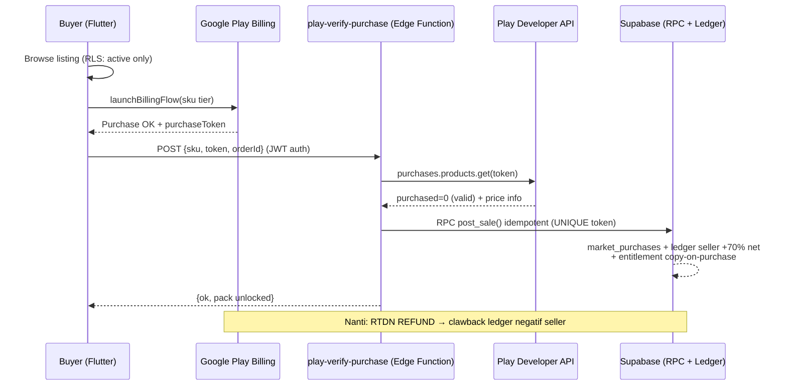

# Sticker Pack Marketplace — Analisa & Rencana Detail

Created: 2026-08-25 (waktu lokal project)
Status: **DRAFT — menunggu keputusan owner** (belum ada kode/migrasi yang dikerjakan)

## Objective

Menganalisa dan merencanakan fitur marketplace sticker pack di BikinStiker:
- Setiap user bisa me-listing pack miliknya (deskripsi, harga tier, tag) ke marketplace.
- Selama listing aktif, slot pack terkunci (tidak bisa diedit/ditambah/dihapus).
- User lain membeli via Google Play Billing.
- Revenue split dari **net setelah fee Google Play**: 70% seller, 30% platform.
- Owner = indie developer berdomisili di Indonesia; aplikasi tersedia global.

Dokumen ini adalah bahan keputusan go/no-go + blueprint implementasi jika GO.

## Keputusan yang Sudah Dikonfirmasi Owner

| Aspek | Keputusan |
|---|---|
| Basis komisi | Net setelah fee Google Play (bukan gross) |
| Reward seller | **Cash payout langsung sejak hari pertama** |
| Platform | Android saja dulu (Play Billing), iOS menyusul |
| Model harga | Tier fix (SKU tetap di Play Console): $0.99 / $1.99 / $2.99 / $4.99 |

## Ringkasan Eksekutif (verdict jujur)

Fitur ini **teknis sangat layak** untuk stack现有 (Supabase + Edge Functions + Flutter/Bloc), tapi
kombinasi **cash payout + indie developer Indonesia** adalah titik terberat:

1. Teknis: sulit-sedang (~4–6 minggu kerja efektif). Pola server-side verification sudah ada preseden di repo (`admob-ssv`, ledger kredit sign-consistent).
2. Finansial: sehat HANYA dengan basis net + hold period 60–90 hari + minimum payout threshold.
3. Legal Indonesia: cash payout menyentuh 3 area rawan — PJP Bank Indonesia, PMSE/Permendag 19/2026, pajak (PPh sendiri, PPh 22 PMK 37/2025, WHT lintas negara). Semua butuh validasi konsultan profesional.
4. Operasional: moderasi konten, KYC, clawback refund, payout manual batch = beban mingguan permanen.

**Rekomendasi:** jalankan Fase 0 (legal & prasyarat, tanpa kode monetisasi) dulu.
Jika konsultan menilai struktur payout terlalu berisiko, fallback resmi ada: seller menerima credit in-app
(Fase 3 ditunda), infrastruktur payout disiapkan belakangan bersama partner pembayaran berlisensi.

---

## Milestones

1. Fase 0 — Legal, perizinan, kebijakan store (tanpa fitur)
2. Fase 1 — Listing & slot locking (tanpa uang)
3. Fase 2 — Play Billing, verifikasi server, split ledger
4. Fase 3 — Seller dashboard, KYC, payout pipeline
5. Fase 4 — Hardening, soft launch regional, buka global

## Tasks

### Fase 0 — Legal & Prasyarat (sebelum 1 baris kode monetisasi)
- [ ] Konsultasi hukum+pajak (Rp3–10jt estimasi):
  - [ ] Struktur payout vs lisensi PJP BI (PBI 23/6/PBI/2021) — apakah "klaim on-request" aman?
  - [ ] WHT PPh 26 untuk bayar seller non-residen
  - [ ] Ketergantungan PMSE: SIUPMSE/TDPSE + implikasi Permendag 19/2026
  - [ ] PPh Final UMKM 0.5% (PP 55/2022) untuk penghasilan komisi platform
- [ ] Registrasi administratif:
  - [ ] NPWP + NIB (via OSS)
  - [ ] SIUPMSE (KBLI 63122) + TDPSE
  - [ ] DMCA agent registration (US Copyright Office, ~$6–200 tergantung kategori)
- [ ] Google Play:
  - [ ] Konfirmasi resmi ke Play policy support: revenue-share marketplace UGC dengan cash payout diizinkan ⚠️ BLOCKER Fase 2
  - [ ] Cek enrollment service fee (Earn → Service fees) → dapatkan % aktual
  - [ ] Buat 4 one-time SKU non-consumable: `pack_tier_099`, `pack_tier_199`, `pack_tier_299`, `pack_tier_499`
  - [ ] Setup merchant account payout schedule (pahami lag ±30 hari)
- [ ] Legal dokumen (draft dibawa ke konsultan):
  - [ ] ToS baru: hak seller (lisensi non-eksklusif ke platform), indemnifikasi IP, buyer dapat lisensi pakai (bukan transfer cipta), kebijakan forfeit saldo dorman 12 bulan, hold earnings 75 hari, usia minimal seller 18+
  - [ ] Privacy policy tambahan: data KYC (nama legal, rekening/PayPal, NPWP opsional), retention
  - Catatan: publish versi dokumen baru otomatis memicu re-consent flow (`legal_consent` registry sudah mendukung versi/hash)

### Fase 1 — Listing & Slot Locking (tanpa uang)
- [ ] Migration `marketplace_schema.sql` (non-destruktif):
  - [ ] `price_tiers` (sku PK, usd_cents, display_label, is_active)
  - [ ] `market_listings` (id, pack_id FK UNIQUE WHERE status aktif, seller_id, tier_sku FK,
        description ≤500 char, tags text[] ≤8, status enum `pending_review|active|paused|removed`,
        moderated_at, moderator_note, reported_count int default 0, timestamps)
  - [ ] `listing_reports` (listing_id, reporter_id, reason enum, note, status, created_at;
        UNIQUE(listing_id, reporter_id))
  - [ ] RLS strict: seller hanya CRUD listing miliknya via RPC SECURITY DEFINER;
        pembaca listing aktif untuk semua authenticated; admin-only moderation (pola existing)
  - [ ] RPC: `create_market_listing(pack_id, tier_sku, description, tags)` — validasi kepemilikan pack,
        pack ≥3 stiker, tidak ada listing aktif lain, insert status `pending_review`
  - [ ] RPC: `unlist_market_listing(listing_id)` — hanya jika belum ada pembelian outstanding reserve
  - [ ] RPC: `report_listing(listing_id, reason)`
- [ ] Slot locking:
  - [ ] DB-level: blokir edit/add/delete stiker pack via RPC existing ketika listing aktif
        (join existence, bukan kolom baru → unlist otomatis membuka slot)
  - [ ] Flutter model `StickerPack`: getter `canAddStickers/canRename/canDelete/canRemoveStickers`
        (lib/data/models/sticker_pack.dart:35-44) ditambah kondisi `!isListed`
- [ ] UI (i18n en/id wajib):
  - [ ] Marketplace browse screen (grid, search by tag/nama, filter tier)
  - [ ] Listing detail (preview stiker, deskripsi, tag, tombol beli placeholder)
  - [ ] "List my pack" flow dari Pack Detail (pilih tier + form)
  - [ ] Report listing dialog
  - [ ] Moderation queue sederhana untuk owner (bisa query SQL manual di awal — UI admin opsional)
- [ ] Test: unit RPC logic, widget test lock behavior, analyze, build apk

### Fase 2 — Play Billing & Split Ledger (BLOCKER: konfirmasi Play policy dari Fase 0)
- [ ] Dependency `in_app_purchase`; gate transaksi uang asli ke akun Google Sign-In (guest dilarang)
- [ ] Edge Function `play-verify-purchase`:
  - Input `{sku, purchase_token, order_id}` post-acknowledge
  - Verifikasi ke Google Play Developer API `purchases.products.get`
    (service account JSON di Supabase secrets; credential pattern seperti provider configs)
  - Idempotensi via UNIQUE(purchase_token); posting split dalam 1 transaksi:
    `market_purchases` + 2 entri `seller_earnings_ledger` (seller share positif) +
    snapshot fee store saat itu
- [ ] Edge Function `play-rtdn-webhook` (Pub/Sub push, verify JWT Pub/Sub):
  - `PURCHASED` → no-op (jalur utama tetap client-initiated verify)
  - `REFUNDED` / `REVOKED` → tandai purchase refunded + entri ledger NEGATIF seller
    (clawback; CHECK sign-consistency sudah mendukung nilai negatif — pola `surprise_prompt`)
- [ ] Tabel `seller_earnings_ledger` (migration Fase 2):
  append-only, user_id, amount_usd_cents (signed), type enum `sale|refund_clawback|payout|adjustment`,
  ref_id (purchase/payout id), balance_after, created_at
- [ ] Rumus split (server-side single source of truth):
  `net = gross − store_fee` (store_fee dari Developer API priceCurrencyInfo + % terdaftar),
  `seller_share = floor(net × 0.70)`, `platform_share = net − seller_share`
- [ ] Entitlement: tabel `pack_entitlements` (buyer_id, pack_id, source_purchase_id);
  copy-on-purchase metadata agar buyer export ke WhatsApp lewat pipeline existing
- [ ] Test Deno: mock Developer API sukses/gagal/token replay/refund webhook/idempotensi (target ≥15 test)
- [ ] Test Flutter: billing bloc, error mapping (user cancel/unavailable), analyze, build

### Fase 3 — Seller Dashboard, KYC, Payout
- [ ] Tabel `seller_kyc` (user_id UNIQUE, legal_name, country, npwp nullable, payout_method
      `bank_id|paypal`, destination_snapshot jsonb, status `pending|verified|rejected`,
      reviewed_at) + alur submit + review manual oleh owner
- [ ] Gate: listing baru + payout request hanya untuk KYC verified + usia 18+ declaration
- [ ] Aturan payout (hard-coded di RPC + tampil transparan di UI):
  - Minimum payout: USD 25 (atau ekuivalen)
  - Eligible window: penjualan eligible setelah 75 hari (rolling reserve utk refund/clawback)
  - Clawback: jika ledger balance minus, payout otomatis diblokir sampai pulih
- [ ] RPC `request_payout()` — hitung eligible balance, kurangi ledger (entri negatif type=payout),
      insert `payout_requests(status=requested)`
- [ ] Eksekusi payout MANUAL/batch oleh owner di awal (template transfer bank / PayPal masspay);
      update status `paid` + bukti transfer disimpan (audit trail)
- [ ] Seller dashboard UI: earnings summary, ledger history, payout request, KYC form, i18n en/id
- [ ] Email notifikasi sederhana (reuse Resend pattern dari operator_alerts)

### Fase 4 — Hardening & Launch
- [ ] Anti-fraud rule dasar: rate limit listing/user, auto-suspend listing setelah N report unik,
      deteksi self-purchase (buyer == seller) → tolak di verify
- [ ] Sanctions screening sederhana: whitelist negara payout + screening nama KYC (manual awal)
- [ ] Analytics views: GMV harian, take rate aktual, refund rate, pending reserve, top sellers
- [ ] Load test webhook + monitoring alert (pattern operator_alerts)
- [ ] Soft launch: batasi region pembeli (Play Console country availability) 2–4 minggu → evaluasi
      refund rate & moderasi → buka global
- [ ] Verifikasi penuh: deno test all, flutter analyze/test/build apk --split-per-abi, preflight MCP read

---

## Analisa Finansial (detail)

### Struktur fee Google Play per 2026 (sudah berubah dari era 15%/30%)

Model baru: service fee + **billing fee 5%** (US/UK/EEA) untuk transaksi Play Billing.

| Skenario (one-time product) | Estimasi total efektif |
|---|---|
| Standard, install baru | 20% (+5% billing fee region tertentu) ≈ 20–25% |
| Standard, install lama | 25% (+5%) ≈ 25–30% |
| Tier legacy 15% first-$1M (jika masih enrolled) | ≈ 15–20% |

Action item Fase 0: ambil angka AKTUAL dari Play Console, jangan pakai asumsi dokumen ini.

### Simulasi per penjualan (basis net, asumsi total fee 22%, pembulatan ke sen)

| Tier | Gross | Net | Seller 70% | Platform 30% |
|---|---|---|---|---|
| $0.99 | $0.99 | $0.77 | $0.54 | $0.23 |
| $1.99 | $1.99 | $1.55 | $1.09 | $0.47 |
| $2.99 | $2.99 | $2.33 | $1.63 | $0.70 |
| $4.99 | $4.99 | $3.89 | $2.72 | $1.17 |

Margin platform 30%-dari-net ≈ 23% dari gross — SEBELUM biaya operasional di bawah.

### Biaya operasional yang menggerus margin

| Item | Estimasi | Mitigasi wajib |
|---|---|---|
| Fee payout (PayPal/Wise/Payoneer) | 2–4% + fixed | Minimum payout threshold $25 |
| Refund/chargeback clawback | 100% nilai sale dicabut Google | Hold 75 hari + ledger negatif |
| Moderasi + support | Waktu mingguan permanen | Review queue manual, FAQ |
| Konsultan hukum/pajak (awal) | Rp3–10jt | Sekali di Fase 0 |

### Timeline arus kas (kenapa hold itu wajib)

```
Hari 0            Hari ~30              Hari ~75            Hari ~90+
Penjualan ──────► Google payout ke ───► Earning seller ───► Batch payout
(refund masih    merchant account      menjadi eligible     manual ke seller
 mungkin)         (lag ±30 hari)       (reserve habis)
```

Refund bisa terjadi hingga ±48 jam auto + kapan pun via Google support.
Kalau seller sudah dibayar dan uang dicabut Google → platform menanggung rugi penuh.
Hold 60–90 hari menutup mayoritas risiko ini.

---

## Analisa Legal (detail + tingkat kepastian)

> Bukan nasihat hukum. Item 🔴 = wajib validasi konsultan sebelum launch cash payout.

### Indonesia

| Isu | Tingkat risiko | Inti masalah | Arah mitigasi |
|---|---|---|---|
| Lisensi PJP BI | 🔴 Tinggi | Menampung & menyalurkan dana milik orang lain bisa dikualifikasi jasa pembayaran (PBI 23/6/PBI/2021). Modal minimum Rp500jt–Rp15M. Indie mustahil ambil lisensi. | Jangan bangun "wallet" (dana milik seller). Strukturkan sebagai klaim/receivable on-request; atau partner PJP berlisensi (Xendit/DOKU/Flip) untuk disbursement. Butuh pendapat hukum. |
| PMSE (PP 80/2019 + Permendag 19/2026) | 🟡 Sedang | Model bisnis mirip "marketplace". PP 80/2019 mengecualikan penjual kasual/temporal dari definisi Pedagang (argumen pro), tapi penjualan rutin komersial kemungkinan masuk. Permendag 19/2026 mewajibkan verifikasi izin usaha pedagang domestik — berat untuk user anonim. | Registrasi SIUPMSE (OSS, KBLI 63122) + TDPSE. Pertimbangkan batasi seller cash-out ke user terverifikasi di fase awal. |
| PPh platform (penghasilanmu) | 🟡 Sedang | Komisi 30%-net = penghasilan usaha. | NPWP + NIB; PPh Final UMKM 0.5% (PP 55/2022) jika omzet < Rp4.8M/thn. |
| PPh 22 pemungutan marketplace | 🟡 Sedang | PMK 37/2025: marketplace bisa DITUNUK DJP memungut 0.5% bruto seller domestik; pengecualian individu omzet ≤ Rp500jt dengan surat pernyataan. Kewajiban lahir setelah ditunjuk. | Kumpulkan data identitas seller sejak KYC agar siap. |
| WHT lintas negara (PPh 26) | 🔴 Tinggi | Bayar seller non-residen punya analisis pemotongan tersendiri tergantung karakterisasi (royalti/jasa/barang digital). Sangat teknis. | Konsultan pajak. Opsi pragmatis: fase awal seller payout hanya Indonesia. |
| VAT/PBB penjualan | 🟢 Rendah | Pembeli bayar via Google Play → Google merchant of record, urus VAT/GST. | Tidak ada aksi khusus. |
| Perlindungan konsumen | 🟢 Rendah–Sedang | Refund pembeli ditangani kebijakan refund Google Play; sengketa seller-butuh mekanisme pengaduan (juga syarat Permendag utk marketplace). | Halaman help + email support + alur dispute sederhana. |

### Google Play policy

- Purchase memberi akses konten digital → **Play Billing wajib** (keputusan arsitektur sudah benar).
- Tips 100%-ke-creator dikecualikan dari Play Billing, tapi kasus kita (akses konten) TIDAK termasuk pengecualian.
- ⚠️ **Belum ada konfirmasi eksplisit** bahwa revenue-share cash payout ke creator diizinkan tanpa syarat tambahan. Contoh industri (Wattpad Paid Stories, dsb.) melakukannya → kemungkinan besar OK, tapi wajib konfirmasi policy support sebelum Fase 2. Ini BLOCKER.
- UGC policy (wajib ada di app): report/block per listing, content standards, moderasi, takedown. Tanpa ini akun developer berisiko tindakan.
- Refund/revocation: Google mencabut 100% nilai sale dari payout developer → sistem clawback wajib.

### Konten & IP

- Stiker murni-AI: hak cipta dipersoalkan di banyak yurisdiksi (AS menolak karya tanpa unsur manusia; UU Hak Cipta RI mensyaratkan pencipta manusia). Konsekuensi praktis:
  - Buyer mendapat **lisensi pakai**, bukan transfer hak cipta.
  - Seller memberi **lisensi non-eksklusif** ke platform + **indemnifikasi** atas klaim pihak ketiga.
- Infringement (prompt karakter berhak cipta): filter prompt existing + review queue pra-publish + alur DMCA takedown + repeat-infringer ban + registrasi DMCA agent.
- Usia: seller wajib 18+ (kontrak + terima uang).

---

## Arsitektur Teknis (ringkas tapi implementable)

### Kendala fundamental Play Billing
1. Tidak ada harga dinamis → 4 SKU tier fix di Play Console + tabel `price_tiers` di DB sebagai mapping.
2. Validasi server-side wajib → RTDN + Developer API (preseden repo: `admob-ssv`).
3. Entitlement non-consumable terikat akun → restorable lintas device via record server.

### Diagram alur pembelian



### Keputusan desain penting
- **Slot lock via existence join**, bukan kolom baru → unlist otomatis membuka slot; DB tetap sumber kebenaran.
- **Guest dilarang transaksi** → wajib Google Sign-In (guest session + uang asli = tiket dukungan/dispute).
- **Ledger append-only sign-consistent** (pola `credit_transactions`) → audit trail lengkap, clawback = entri negatif.
- **Split dihitung server** dari data Developer API, tidak pernah percaya angka client.
- Re-consent legal otomatis via `legal_consent` registry saat dokumen dinaikkan versinya.

---

## Matriks Risiko Utama

| # | Risiko | Dampak | Probabilitas | Mitigasi |
|---|---|---|---|---|
| R1 | Struktur payout dinilai = aktivitas PJP BI | Fitur cash payout batal/dimodifikasi | Sedang | Pendapat hukum Fase 0; fallback credits-first |
| R2 | Play policy menolak revenue-share payout | Fase 2 diblokir | Rendah–Sedang | Konfirmasi tertulis pra-development |
| R3 | Gelombang refund/clawback mengalahkan margin | Rugi finansial | Sedang | Hold 75 hari, min threshold, monitor refund rate di soft launch |
| R4 | Listing infringement (IP pihak ketiga) | DMCA/takedown, risiko akun dev | Tinggi | Review queue, takedown <24h, repeat-infringer ban |
| R5 | Beban operasional KYC+payout manual melelahkan | Burnout owner solo | Sedang | Threshold tinggi ($25), batch mingguan, batasi seller awal |
| R6 | Fee store aktual > asumsi 22% | Margin platform tipis | Sedang | Cek angka aktual Fase 0; opsi sesuaikan split/tier |
| R7 | Guest account purchase chaos | Support burden | Rendah (sudah di-gate) | Enforce Sign-In sebelum checkout |

---

## Biaya & Estimasi Waktu

| Item | Nilai |
|---|---|
| Konsultan hukum+pajak | Rp3–10jt (sekali) |
| Registrasi OSS/SIUPMSE/TDPSE/DMCA | < Rp1jt |
| Fee payout provider | 2–4% per payout |
| Effort development Fase 1–4 | ±4–6 minggu kerja part-time indie |
| Effort operasional pasca-launch | 2–5 jam/minggu (moderasi+payout+support) naik seiring volume |

---

## Checklist Go / No-Go (untuk keputusan owner)

GO hanya jika SEMUA hijau:
1. ☐ Konsultan: struktur payout aman ATAU fallback credits diterima
2. ☐ Play policy support: revenue-share payout OK (tertulis/email)
3. ☐ Fee store aktual diketahui, simulasi margin masih masuk akal (>10% dari gross)
4. ☐ Owner siap komitmen operasional mingguan (moderasi/KYC/payout)
5. ☐ Dokumen legal v2 siap + re-consent teruji

## Risks

Lihat Matriks Risiko Utama. Risiko #1 dan #2 adalah blocker yang harus beres sebelum Fase 2 dimulai.

## Progress Log

- 2026-08-25 — Plan dibuat hasil analisa (riset web kebijakan Play 2026, regulasi ID: PP 80/2019, Permendag 19/2026, PMK 37/2025, PBI 23/6/PBI/2021) + jawaban kuesioner owner (basis net, cash payout, Android-first, tier fix). Belum ada implementasi.

## Notes

- Angka fee Google Play di dokumen ini = estimasi dari halaman bantuan publik per Aug 2026; WAJIB diverifikasi ulang di Play Console karena program fee sering berubah.
- Sumber kunci: support.google.com (Payments policy, Service fees, lower service fees), pajak.go.id (PMK 37/2025), pasal.id + dfdl.com (Permendag 19/2026), bi.go.id (PBI 23/6/PBI/2021), ditjenpdn.kemendag.go.id (SIUPMSE FAQ).
- Fallback resmi jika legal payout gagal: Phase 1–2 tetap valid; ganti reward seller dari USD ledger ke credit in-app (infrastruktur credit sudah ada) → menghilangkan PJP/WHT/KYC hampir seluruhnya.
